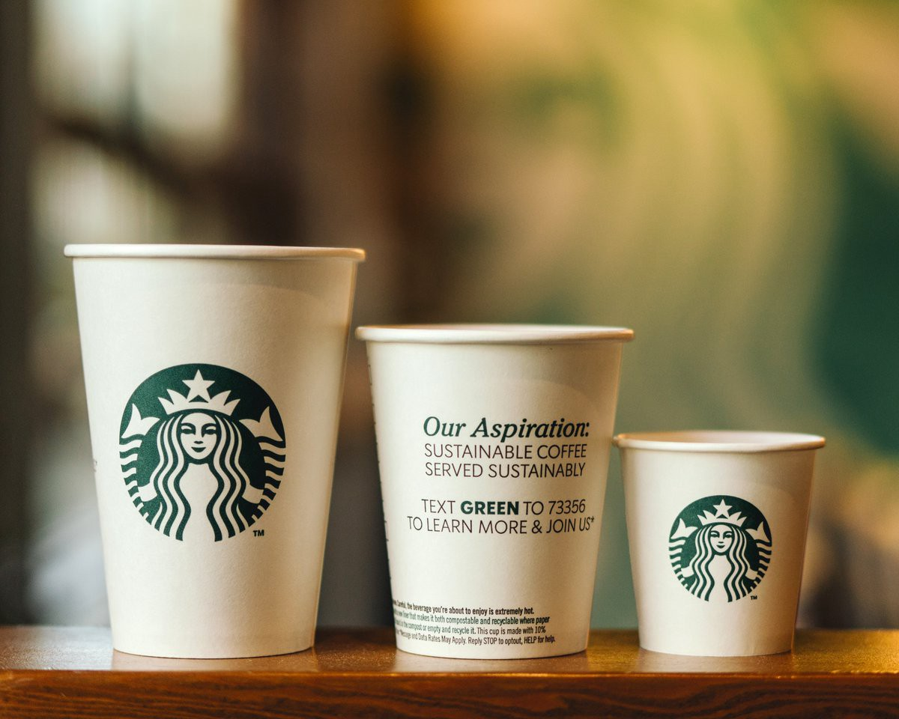

# Starbucks-rewards-mobile-app-EDA
> Project in Data Scientist Nanodegree of Udacity

## Project Motivation

It is the Starbuck's Capstone Challenge of the Data Scientist Nanodegree in Udacity. We get the dataset from the program that creates the data simulates how people make purchasing decisions and how those decisions are influenced by promotional offers. We want to make a recommendation engine that recommends Starbucks which offer should be sent to a particular customer.

## Installation 

There should be no necessary libraries to run the code here beyond the Anaconda distribution of Python.  The code should run with no issues using Python versions 3.*.

## File Descriptions 

The notebook available here showcases work related to the above questions.  

This data set is a simplified version of the real Starbucks app because the underlying simulator only has one product whereas Starbucks actually sells dozens of products. and store in zip file

The data is contained in three files:
- `portfolio.json` - containing offer ids and meta data about each offer (duration, type, etc.)
- `profile.json` - demographic data for each customer
- `transcript.json` - records for transactions, offers received, offers viewed, and offers completed

Here is the schema and explanation of each variable in the files:

`portfolio.json`
- id (string) - offer id
- offer_type (string) - the type of offer ie BOGO, discount, informational
- difficulty (int) - the minimum required to spend to complete an offer
- reward (int) - the reward is given for completing an offer
- duration (int) - time for the offer to be open, in days
- channels (list of strings)

`profile.json`
- age (int) - age of the customer
- became_member_on (int) - the date when customer created an app account
- gender (str) - gender of the customer (note some entries contain 'O' for other rather than M or F)
- id (str) - customer id
- income (float) - customer's income

`transcript.json`
- event (str) - record description (ie transaction, offer received, offer viewed, etc.)
- person (str) - customer id
- time (int) - time in hours since the start of the test. The data begins at time t=0
- value - (dict of strings) - either an offer id or transaction amount depending on the record

## Results

The main findings of the code can be found at the post available [here](https://medium.com/@sahilpatni95/starbucks-capstone-project-b8d2d1363a11).

Based on the transcript records, we build an user-item-matrix that represents how users responded to the offers they received. We then split the records into the training set and the test set and trained our SVD algorithm to predict how a user responses to a particular offer. We achieved the lowest mean square error around 0.003823 with 15 latent features with the training set and around 0.009175 with 10 latent features with the testing set. After that, we created a recommendation engine that recommends Starbucks which offer should be sent to a particular user.

In the later section, we found out which demographic groups respond best to which offer type. Female respond much better than men, in both BOGO and discount. Men react slightly better to discount than BOGO. We also found that it is better to promote the offer via social media. Among the ten offers, sending buy 10 dollars get 2 dollars off within 10 days offer via email, web, mobile and social makes Starbucks gain more. It is the best offer so far!

